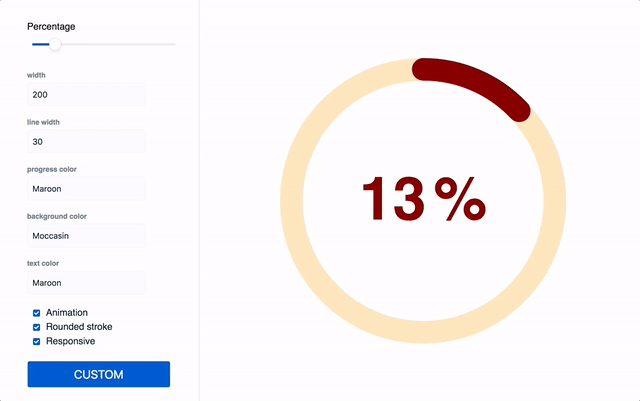

<div align="center">
  
  <br><br>
</div>

# react-circle [](https://travis-ci.org/zzarcon/react-circle)
> Renders a svg circle + percentage. It just works

# Demo
[https://zzarcon.github.io/react-circle](https://zzarcon.github.io/react-circle/)
# Install 🚀

```
$ yarn add react-circle
```

# Usage ⛏

**Basic** 🙃

ReactCircle is opinionated and comes with default size and colors, just pass the **progress** prop to get them:

```javascript
import Circle from 'react-circle';

<Circle
  progress={35}
/>
```

**Custom** 💅

Optionally, you can pass the following props and customize it as your will

```javascript
import Circle from 'react-circle';

// All avaliable props for customization:
// Details are ordered as:
// <Type>: <Description>
<Circle
  animate={true} // Boolean: Animated/Static progress
  animationDuration="1s" //String: Length of animation
  responsive={true} // Boolean: Make SVG adapt to parent size
  size={150} // Number: Defines the size of the circle.
  lineWidth={14} // Number: Defines the thickness of the circle's stroke.
  progress={69} // Number: Update to change the progress and percentage.
  progressColor="cornflowerblue"  // String: Color of "progress" portion of circle.
  bgColor="whitesmoke" // String: Color of "empty" portion of circle.
  textColor="hotpink" // String: Color of percentage text color.
  textStyle={{
    font: 'bold 5rem Helvetica, Arial, sans-serif' // CSSProperties: Custom styling for percentage.
  }}
  percentSpacing={10} // Number: Adjust spacing of "%" symbol and number.
  roundedStroke={true} // Boolean: Rounded/Flat line ends
  showPercentage={true} // Boolean: Show/hide percentage.
  showPercentageSymbol={true} // Boolean: Show/hide only the "%" symbol.
/>
```

# Features

* No external dependencies
* No external styles
* 2KB size => https://bundlephobia.com/result?p=react-circle